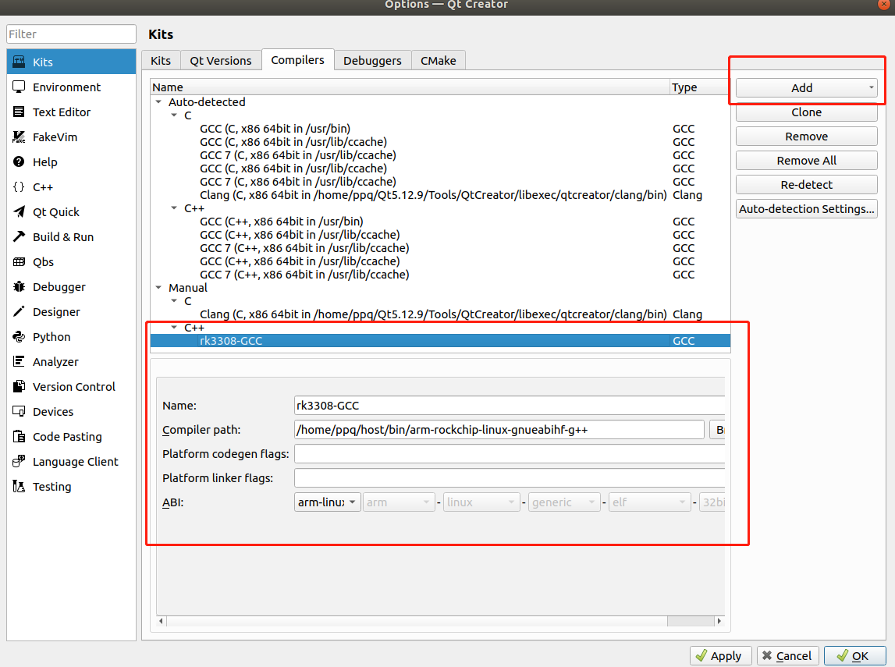
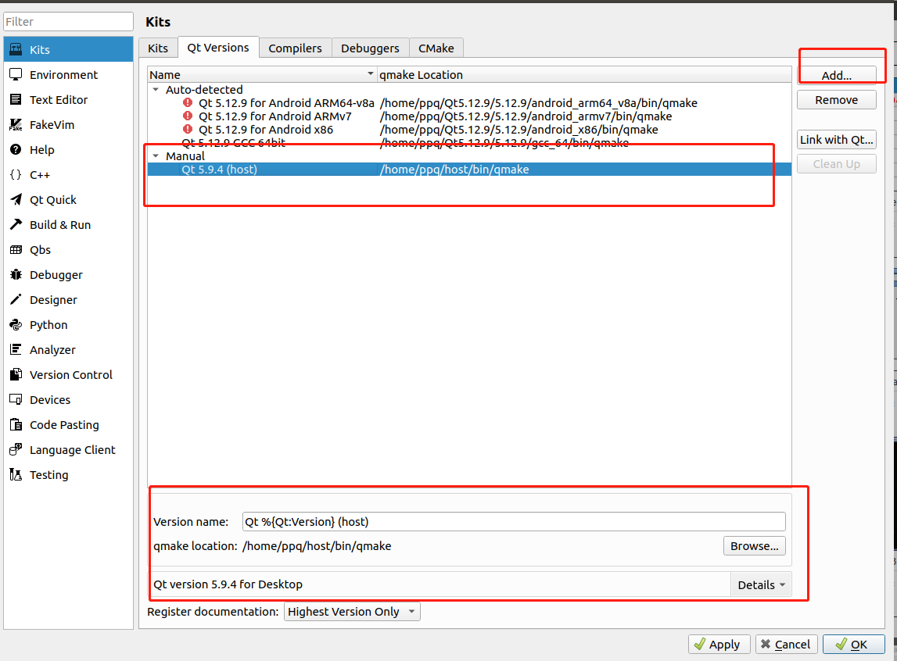
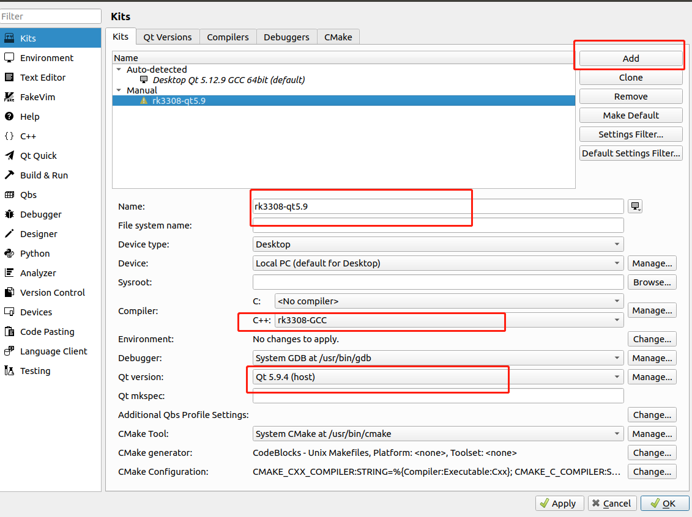

# X50BCZ UI

## 编译
### QT Creator交叉环境搭建并编译
1. 安装QT Creator,插件要选择qml相关的  
2. 解压交叉编译工具链
3.    
4.    
5.    
6. 编译目录下添加libqrencode二维码生成库  
7. 编译生成可执行文件X50QML  
### qmake命令行编译
1. 解压交叉编译工具链
2. qmake -v
3.  ~/host/bin/qmake X50QML.pro(qmake具体路径按实际情况)  
4.  make  
5.  当前目录编译生成可执行文件X50QML   
## 运行程序
在X50QML同级目录下添加如下文件  
1.  recipes：菜谱图片  
2.  themes：UI显示需要本地图片  
3.  RecipesDetails.json：菜谱详情文件  
4.  SourceHanSansCN-Regular.ttf：字体文件  